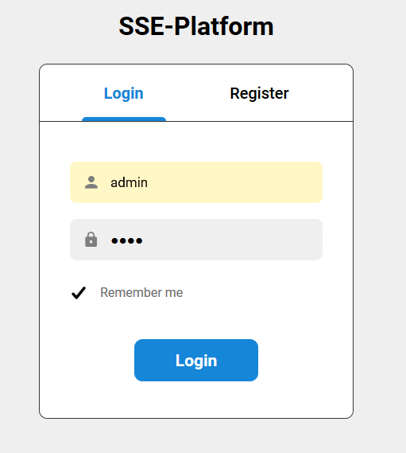
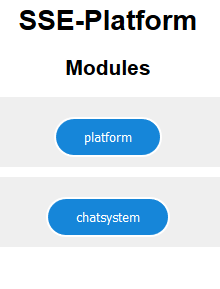

# SocialServ

This is a simple implementation of a social network. It provides all standard functionality such as posting, liking, following, etc.

## Prerequisites:

- Install [MongoDB](https://docs.mongodb.com/manual/installation/) for your OS on default port

- This project is not supposed to be standalone, but rather used in our [platform application](https://github.com/Smunfr/sse-platform). Therefore you first need to install this platform. Follow the instructions in the repository.

## Installation

- you can install the social network's requirements using pip. simply execute:
  ```sh
  $ pip install -r requirements.txt
  ```
  Thats all you need to do.

## Running the social network

- for debugging and developing:
  start dummy_platform.py in a separate terminal:
  ```sh
  $ python3 dummy_platform.py
  ```
  In another terminal window, start the actual social network with the dev flag:
  ```sh
  $ python3 main.py --dev
  ```
  In this mode no authentication is required and there are only dummy users for testing.

- for production situation:
  - fire up the platform application (please refer to the guide in the repo)
  - check the port you started the platform on. If it is not 8888, change the value of PLATFORM_PORT in SOCIALSERV_CONSTANTS.py to your port
  - run
    ```sh
    $ python signing.py
    ```
    once to generate the files "signing_key.key" and "verify_key.key". Keep the signing key secret AT ALL COST. Take the verify_key and insert "SocialServ": "\<verify_key_here\>", into the verify_keys.json file over at the platform
  - run the following to start the network:
    ```sh
    $ python3 main.py
    ```

 Login to Platform | User View
 :------------------------------------:|:-------------------------:
  | 


## Features
The pictures below show examples for the current visualization state of the features.
### Newsfeed, Streaming and Timelines

The most important feature of this social network is the **Newsfeed** with it's ability to **post**, **review** and **interact** with data.

There are different types of timelines:
  - your **personal timeline**: i.e. your posts, posts of users you follow, posts in spaces you are in
  - another **users timeline** (e.g. for his profile)
  - timeline of a certain **space**
  - timeline of **all posts** (all users and all spaces) for admin purposes

Timelines are getting updated automatically and by scrolling down the page.
#### Post:
- **Text** (required)
- **Tags** (optional)
- **Multiple Audio-, Video- and Documentfiles** (optional)
- **Voice Messages** (optional)
>

#### Review & Interact:
- **like** other people's posts (and see people who liked your posts)
- **comment** posts
- **delete** your posts and comments if you dont want to share them anymore
>
---
- **share** posts into your timeline or into workspaces (reposting)
> <br>
---
- **repost** View
>

### Profiles
#### Create your own profile
- **customize** your profile
>
---
>

#### Search and watch other peoples profile
- **search** Users by name
>
- **follow** People u like or just read their latest posts
>

### Workspaces
Create your own Workspaces            |  SocialServ as a Workspace
:-------------------------:|:-------------------------:
  | 
