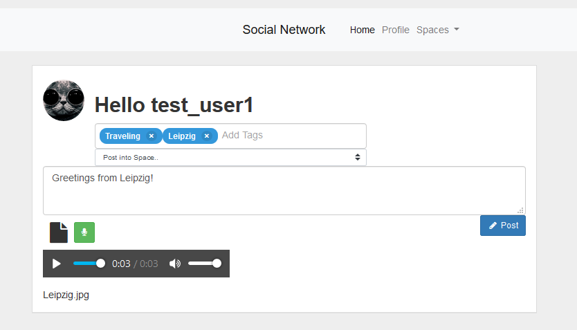
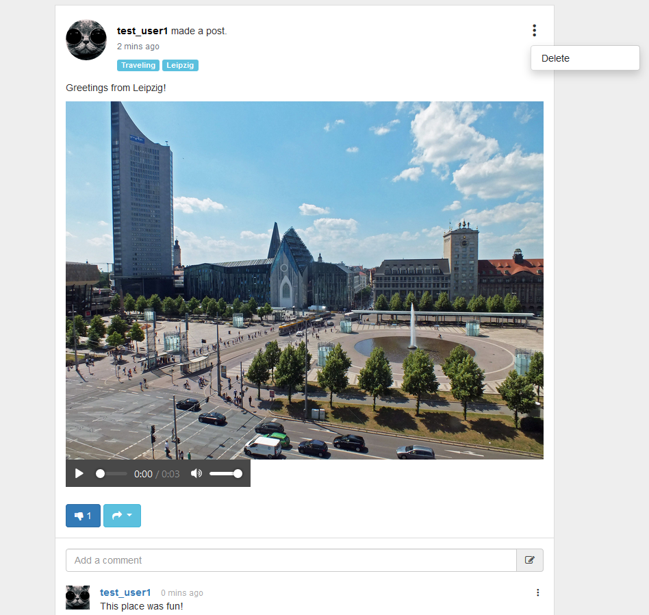
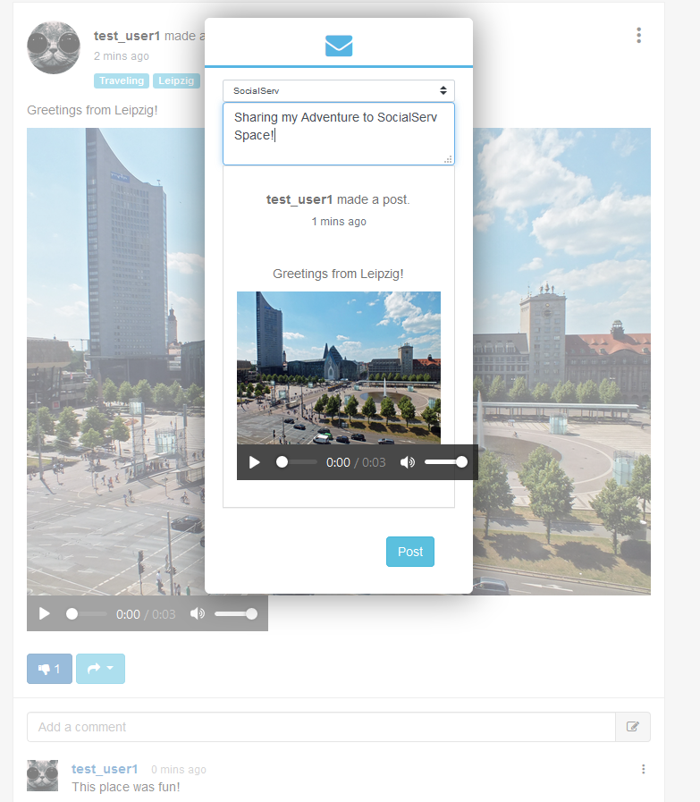
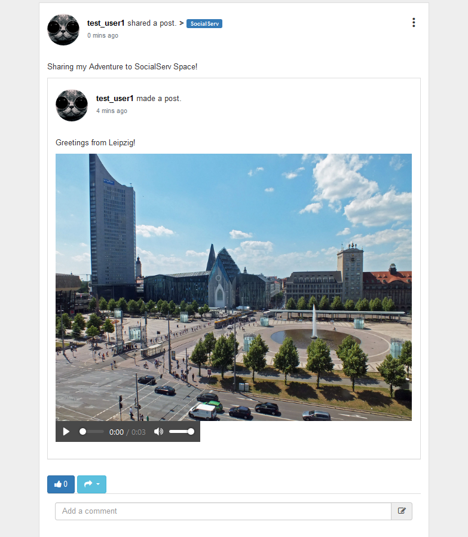
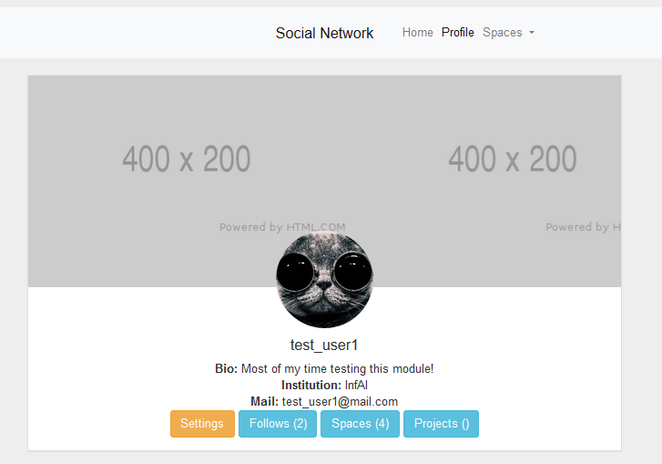
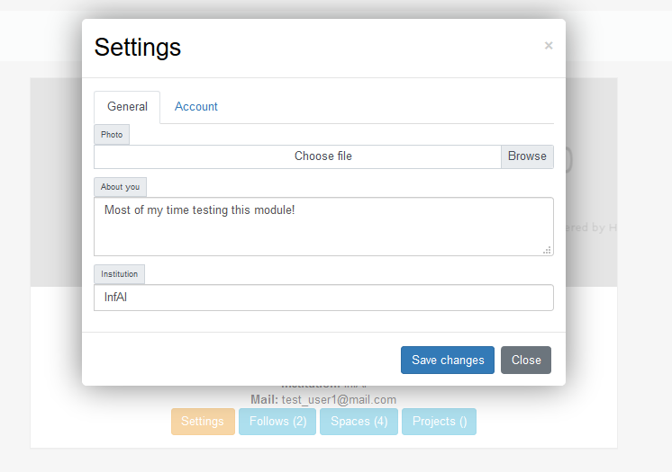
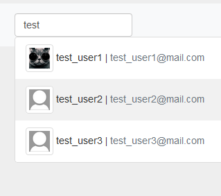
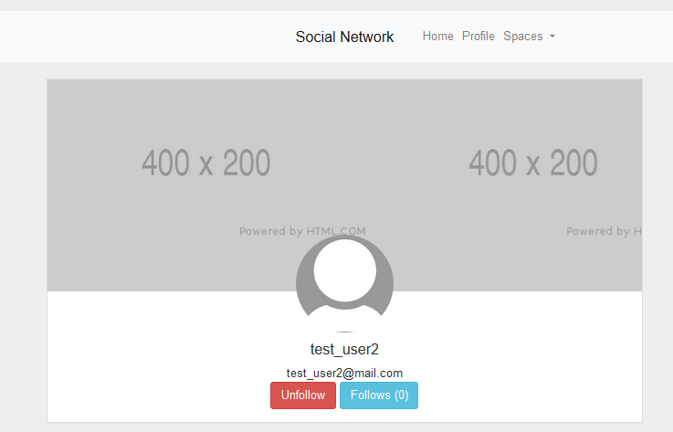
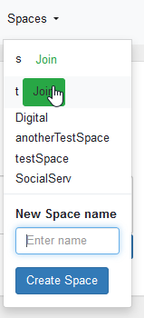
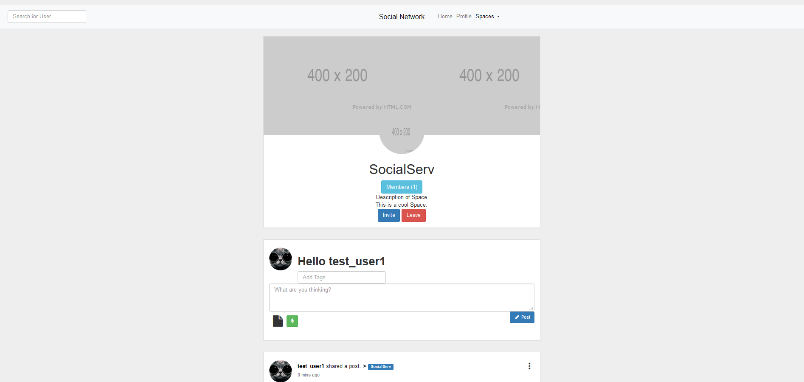

# KAVA Q


Digital Assistance System to plan Virtual Exchanges collaboratively and internationally.

In the current stage, the baseline is layed out: a social network. It provides all standard functionality such as posting, liking, following, etc.

Disclaimer: Features are in a very early Alpha stage and might change drastically.

## Prerequisites:

- Install [MongoDB](https://docs.mongodb.com/manual/installation/) for your OS and [enable Authentication](https://www.mongodb.com/features/mongodb-authentication)
- Setup a [Keycloak](https://www.keycloak.org/) Server and create a realm and users.
- Setup (or rent) a [Wordpress](https://wordpress.com/de/) Instance anywhere and install [this](https://de.wordpress.org/plugins/oauth-client-for-user-authentication/) OAuth plugin to make the integration with Keycloak work. Configure it according to your Keycloak setting.

## Installation

- you can install the kavaq platform's requirements using pip. simply execute:
  ```sh
  $ pip install -r requirements.txt
  ```
  Thats all you need to do.

## Running the social network

- copy the ```example_config.json``` into ```config.json``` and fill in the values according to your Keycloak, MongoDB settings and setups
- run the following command to start the network (parameters in square brackets are optional, read explanation below):
  ```sh
  $ python3 main.py [--config=/path/to/config.json] [--build_indexes] [--create_admin=<username>]
  ```
  - if you desire to store your config file anywhere else than in the main directory, you can use the ```--config=path/to/config/file``` flag
  - on your very first run, it is highly recommended to create an admin user, because otherwise ACL permissions will most certainly not be granted right. Use the ```--create_admin=<username>``` flag. Make sure this username also exists in Keycloak to actually be able to log into this account.
  - The application uses multiple indexes for query optimization and faster reads. They are built automatically if they don't exist. However you can force to rebuild those indexes using the ```--build_indexes``` flag


## Features
```diff
- Disclaimer: pictures are highly out of date, updates of screenshots required
```

The pictures below show examples for the current visualization state of the features.
### Newsfeed, Streaming and Timelines

The most important feature of this social network is the **Newsfeed** with it's ability to **post**, **review** and **interact** with data.

There are different types of timelines:
  - your **personal timeline**: i.e. your posts, posts of users you follow, posts in spaces you are in
  - another **users timeline** (e.g. for his profile)
  - timeline of a certain **space**
  - timeline of **all posts** (all users and all spaces) for admin purposes

Timelines are getting updated automatically and by scrolling down the page.
#### Post:
- **Text** (required)
- **Tags** (optional)
- **Multiple Audio-, Video- and Documentfiles** (optional)
- **Voice Messages** (optional)
>

#### Review & Interact:
- **like** other people's posts (and see people who liked your posts)
- **comment** posts
- **delete** your posts and comments if you dont want to share them anymore
>
---
- **share** posts into your timeline or into workspaces (reposting)
> <br>
---
- **repost** View
>

### Profiles
#### Create your own profile
- **customize** your profile
>
---
>

#### Search and watch other peoples profile
- **search** Users by name
>
- **follow** People u like or just read their latest posts
>

### Workspaces
Create your own Workspaces            |  SocialServ as a Workspace
:-------------------------:|:-------------------------:
  | 