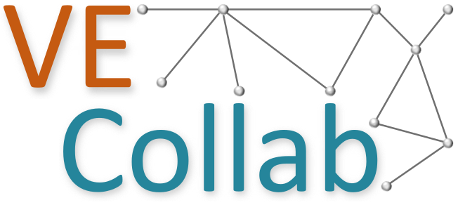

# VE-Collab

<p align="center">
  <a href="https://ve-collab.org/">
    
  </a>
</p>

## 🔍 Project Overview

### Short Description

Virtual exchanges (VEs) are flexible teaching & learning scenarios that combine virtual mobility with media-supported, collaborative work, thus promoting low-threshold national and international collaboration and (inter)cultural understanding.

This research project addressed various problems (inadequate qualification, organizational complexity, difficulties in planning and finding partners) by designing and developing the VE-Collab platform, which aims to build skills and support university lecturers in planning and initiating VEs. The platform includes interactive self-learning materials on VE, a virtual community of practice including a matching process for partner searches, and the "VE-Designer" planning assistant, which guides step by step through the collaborative planning of a VE.

### Live Demo/Preview

[VE-Collab Live Demo](https://ve-collab.org/)


### Tech Stack

- **Languages**: Python 3.10, Typescript
- **Backend**: Tornado
- **Frontend**: Next.js, TailwindCSS
- **Authentication**: Keycloak (via OpenID Connect)
- **Database**: MongoDB, Elasticsearch
- **Deployment**: Docker, Nginx
- **Other**: Etherpad, Wordpress

## 📚 Table of Contents

1. [Getting Started](#-Getting-Started)
2. [Development](#-Development)
3. [Deployment](#-Deployment)
4. [Best Practices](#-Best-Practices)
5. [Testing](#-Testing)
6. [Important Components](#-Important-Components)
7. [License](#-License)

## 🚀 Getting Started

### Prerequisites

Make sure you have the following installed on your machine:

- `Docker`: Latest version

Furthermore, you have to set up a Keycloak instance anywhere with HTTPS, create a realm inside it and also create a client for the platform. One client is sufficient where you set valid redirect URLs for both the backend and frontend. Also inside this realm, create a user with the username `admin` (you can use a different username, in this case change `INTIAL_ADMIN_USERNAME` in `.env` later accordingly). Please refer to the [Keycloak Documentation](https://www.keycloak.org/documentation) for instructions.

### Environment Variables

Make sure you have the `.env` file containing all the configuration.

If you don't have this file:
  - Ask the members of the VE-Collab team to send it to you
  - check the template `.env.example` and fill it out yourself


### Installation

Clone the repository:

```bash
git clone git@github.com:KMI-KPZ/ve-collab.git
cd ve-collab
```

Set reasonably secure API key for etherpad in the file `APIKEY.txt`:

```bash
echo "$(head /dev/urandom | tr -dc A-Za-z0-9 | head -c 25)" > APIKEY.txt
```

Copy Etherpad's configuration into `etherpad_config.json` and fill out the section `ep_openid_connect` at the bottom according to <ins>your</ins> Keycloak instance:

```bash
mv etherpad_config.json.example etherpad_config.json
nano etherpad_config.json
```

### Running the Application

To run the application, it is highly recommended to use the provided `Docker` containers.

To do that, execute:

```bash
docker compose build
docker compose up -d
```

## 🛠️ Development

### Running the platform without Docker

For development it might be more convenient to run the platform without Docker. 

> **Note:** We assume you are still running the dependencies `MongoDB`, `Elasticsearch` and `Etherpad` through their Docker containers. If you wish to also run those natively, please consult their individual documentation pages.


#### Prerequisites

Make sure you have the following installed on your machine:

- `Docker`: Latest version (for dependencies)
- `Python 3.10`
- `Node.js v20`

#### Environment Variables

Both backend and frontend require `.env` files to read the necessary configuration.

If you don't have those files:
  - If you have the global `.env`-file to run the platform via `docker-compose`, simple replicate this file into both backend and frontend subdirectories.
  - Ask the members of the VE-Collab team to send them to you
  - check the templates `.env.example` inside the backend and frontend subdirectories and fill them out yourself

#### Installation

Clone the repository:

```bash
git clone git@github.com:KMI-KPZ/ve-collab.git
cd ve-collab
```

Set reasonably secure API key for etherpad in the file `APIKEY.txt`:

```bash
echo "$(head /dev/urandom | tr -dc A-Za-z0-9 | head -c 25)" > APIKEY.txt
```

Copy Etherpad's configuration into `etherpad_config.json` and fill out the section `ep_openid_connect` at the bottom according to <ins>your</ins> Keycloak instance:

```bash
mv etherpad_config.json.example etherpad_config.json
nano etherpad_config.json
```

#### Services

Run `MongoDB`, `Elasticsearch`, and `Etherpad` through Docker. They need the `.env` file as if the application was run via Docker in full (see [Getting Started](#getting-started)):

```bash
docker compose up -d mongodb elasticsearch etherpad
```

#### Backend

Navigate into subdirectory:

```bash
cd backend
```

Install packages:

```bash
pip install -r requirements.txt
```

Run the backend:

```bash
python3 main.py
```

Optional Command Line Arguments:

- `--build_indexes`: Force the application to (re)build the full text search index
- `--debug`: Run the application in debug mode (hot reload). Obviously, don't use debug mode in production
- `--load_taxonomy`: (Re)load the default taxonomy of learning material
  >**Caution:** This operation performs a full overwrite discarding any previous taxonomy.


#### Frontend

Navigate into subdirectory:

```bash
cd frontend-vecollab
```

Install packages:
```bash
npm install
```

Run the frontend:

```bash
npm run dev
```

## Branch descriptions:

- **dev**: Where all branches derive from and will be pushed to
- **staging**: Intermediate between dev and production to test stuff in a live environment before pushing it to main, has CI/CD
- **master**: production branch, only pull requests from staging go here, has CI/CD


## 🌟 Best Practices

### Clean Code

The backend follows the [Black Formatter](https://pypi.org/project/black/) code style conventions.

The frontend uses [Prettier](https://prettier.io/) with a custom `.prettierrc.json` configuration.

Both tools have plugins for Code Editors like VS Code.


## 🔧 Testing

### Running Tests

Tests are split into model, resource, and api tests, combined by overarching test wrapper. To execute this script, simply run:

```bash
python3 run_tests.py
```

## 📜 License

This project is licensed under [CC-BY-NC-ND 4.0](https://creativecommons.org/licenses/by-nc-nd/4.0/).

Under attribution, you are allowed to use, share and distribute this software <ins>as is</ins>, without commercial use.

